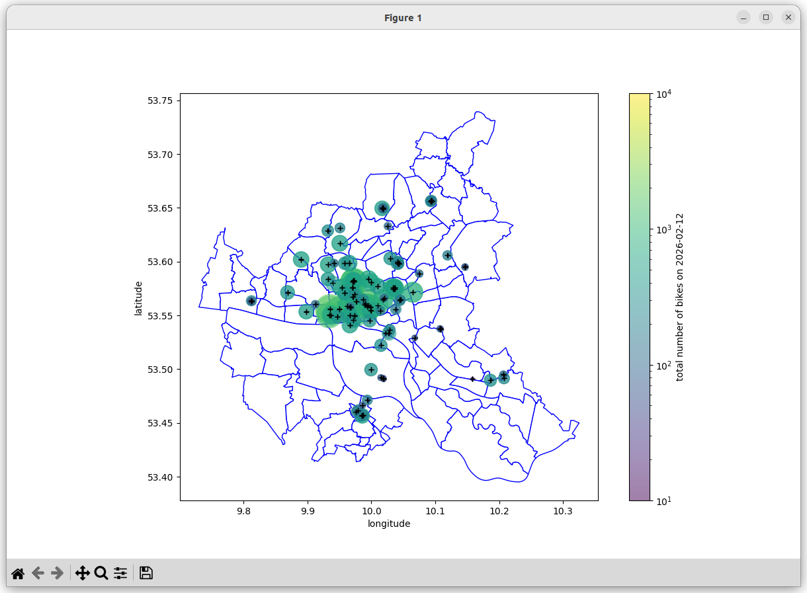

# Analysis of Bike Traffic in Hamburg
Table of Contents:
* [Tech Stack](#tech-stack)
* [Installation](#installation)
* [Example: Plotting Scripts](#example-plotting-scripts)

## Tech Stack
* OS: Ubuntu Server 24.04 LTS
* python 3.10 or newer, with pytest
* postgreSQL v18
* to be implemented: scheduled execution using Apache Airflow DAGs

## Installation
For detailed installation instructions, see [the installation notes](./doc/INSTALL.md).

## Example: Plotting Scripts
This repository contains code for several plots showcasing what can be done with the data. See [this page](./doc/data_observations.md) for more details.

For instance, the script `plot_radverkehr.py` plots traffic counter data loaded from the PostgreSQL database. This is a city map of Hamburg illustrating total bike counts captured by each counter on a particular day.

