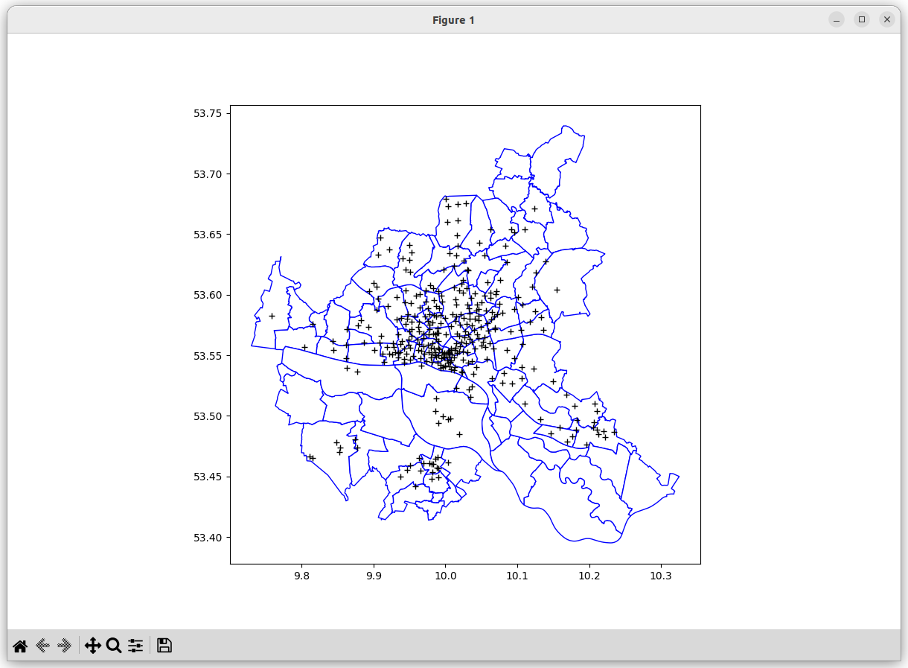

## Data Observations
* The default URLs for data requests to the Hamburg IOT server do not specify the `orderBy` parameter. This results in what appears to be random data ordering (you can verify by repeating the same request after some time). When the server is only returning a part of the entire dataset (by default, 100 elements, use the `top` parameter the change this), it is critical that the data is not random. This was addressed by specifying `orderBy=name` (a parameter that does not depend on the actual data values) and, to accelerate data transfer, `top=500` to get all data in a single response.
* The station reported as `@iot.id=25605` sometimes has geographical coordinates0,0. Before plotting the data, datapoints with coordinates 0,0 are rejected 

## Plotting the Data
The script `plot.py` currently contains code to indicate the positions of the StadtRad stations that are contained in a CSV file.

